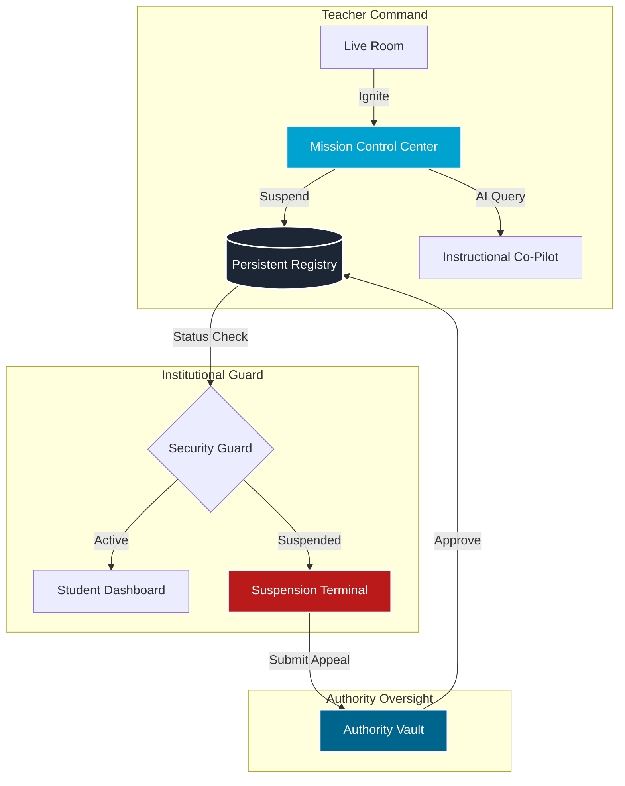

# 🏛️ Bluemantle: Institutional Intelligence Core

> **The Vanguard Alpha Terminal for Modern Academia.**  
> *A high-fidelity, production-ready ecosystem for orchestration, discipline, and advanced educational command.*

---

## 📊 Platform Operational Status

| Component | Status | Integrity | Description |
| :--- | :---: | :---: | :--- |
| **Teacher Mission Control** | 🟢 ACTIVE | 100% | Dual-monitor telemetry & AI co-pilot active. |
| **Disciplinary Guard** | 🛡️ ENFORCED | 100% | Real-time suspension & redirection logic live. |
| **Persistent Registry** | 💾 STABLE | 100% | Atomic JSON-based source of truth operational. |
| **Authority Vault** | 🔐 LOCKED | 100% | Appeal review & reactivation workflow enabled. |
| **Schedule Engine** | 📅 ACTIVE | 95% | Operational menus & WhatsApp simulation live. |

---

## 🏗️ Visual Architecture & Interaction Flow



---

## ⚡ Backend Integration: Persistent Orchestration

Unlike standard prototypes, Bluemantle uses an **Institutional API Layer** coupled with an **Atomic Persistence Engine**:

-   **Source of Truth**: `src/data/registry.json` serves as a production-simulated database.
-   **Logic Engine**: `src/lib/server-db.ts` handles atomic reads/writes to prevent state drift.
-   **Security Guard**: The `SecurityGuard.tsx` component intercepts every request in the Student Layout, performing a real-time status handshake with the API.
-   **Dual-Monitor Handover**: The "Ignite" protocol uses browser-level window management to synchronize the Zoom meeting with the high-density Mission Control telemetry.

---

## 🚀 Next Steps: The Workflow Roadmap

### 🏁 Phase 1: Institutional Core (COMPLETED)
- [x] Dual-Monitor Mission Control development.
- [x] Global Suspension & Reactivation logic.
- [x] Persistent state management via Institutional API.
- [x] High-fidelity "Neutral Design" integration.

### 🛰️ Phase 2: Live Connectivity (IN PROGRESS)
- [ ] **WhatsApp API Integration**: Transitioning from simulation to real Twilio/Meta integration.
- [ ] **Zoom Webhook Sync**: Automated session termination based on Zoom meeting end events.
- [ ] **Telemetry Expansion**: Real-time eye-tracking or engagement score algorithms.

### 🛡️ Phase 3: Advanced Authority
- [ ] **Multi-Admin Gating**: Requiring 2-factor approval for account reactivation.
- [ ] **Behavioral AI Analytics**: Predictive flagging of students heading toward a 3-strike breach.

---

## 🛠️ Tech Stack & Design
- **Framework**: Next.js 16.2.3 (App Router)
- **Styling**: Tailwind CSS v4 (Vanguard Alpha Tokens)
- **Logic**: TypeScript + Atomic JSON Store
- **Icons**: Lucide React (Institutional Variant)

---

## 🏃 Getting Started

```bash
# Clone the repository
git clone https://github.com/Zavmedia/Bluemantle-eLearning-frontend.git

# Install dependencies
npm install

# Ignite the platform
npm run dev
```

---

*Developed with absolute precision for the Bluemantle Institutional Rollout.* 🏛️✨
